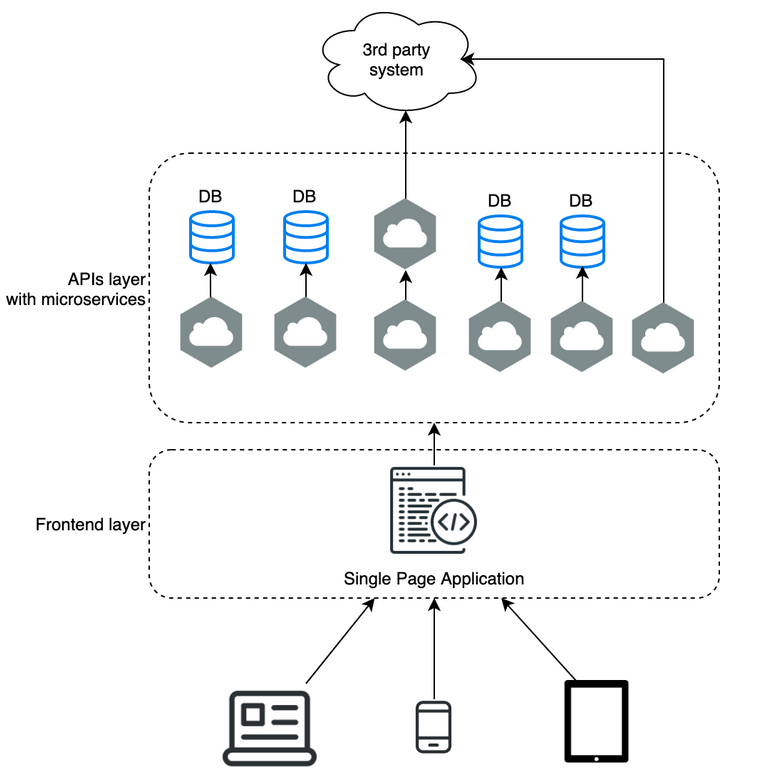
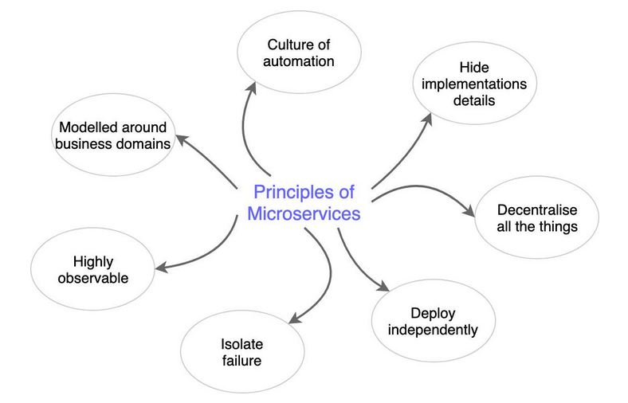
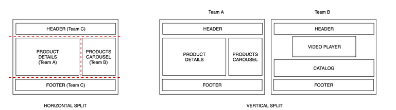
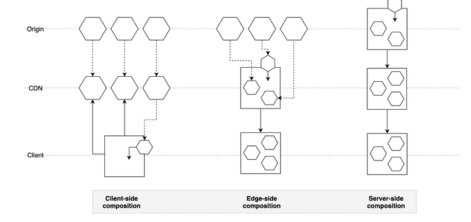
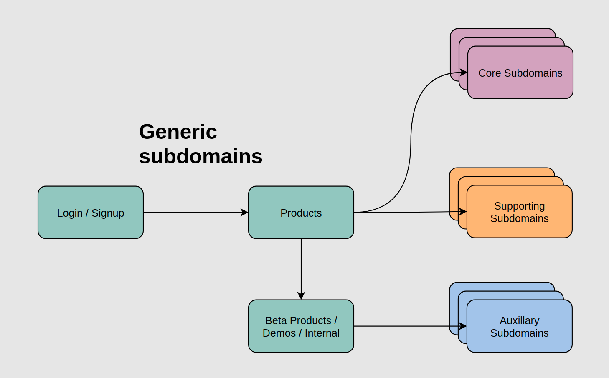
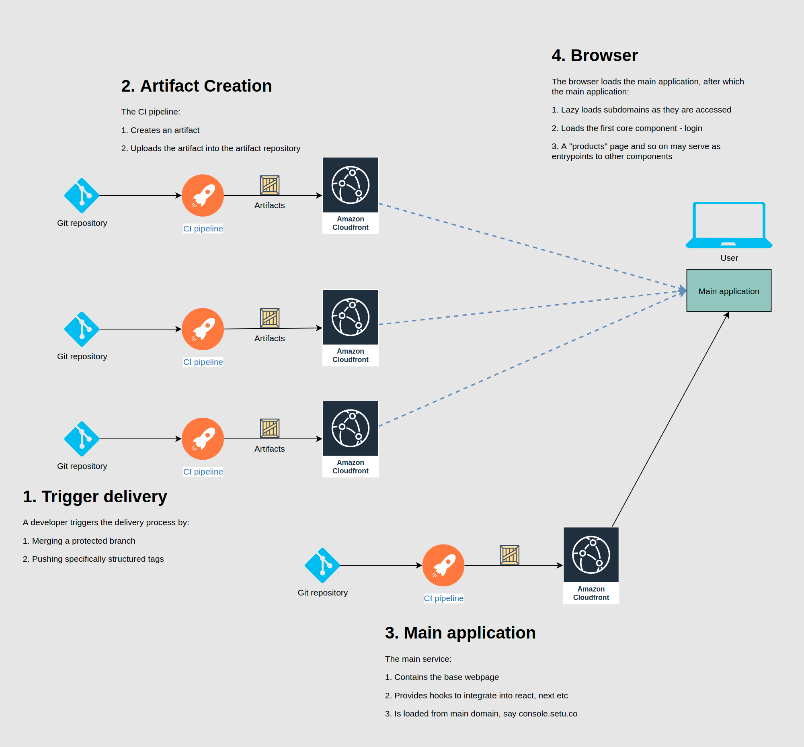
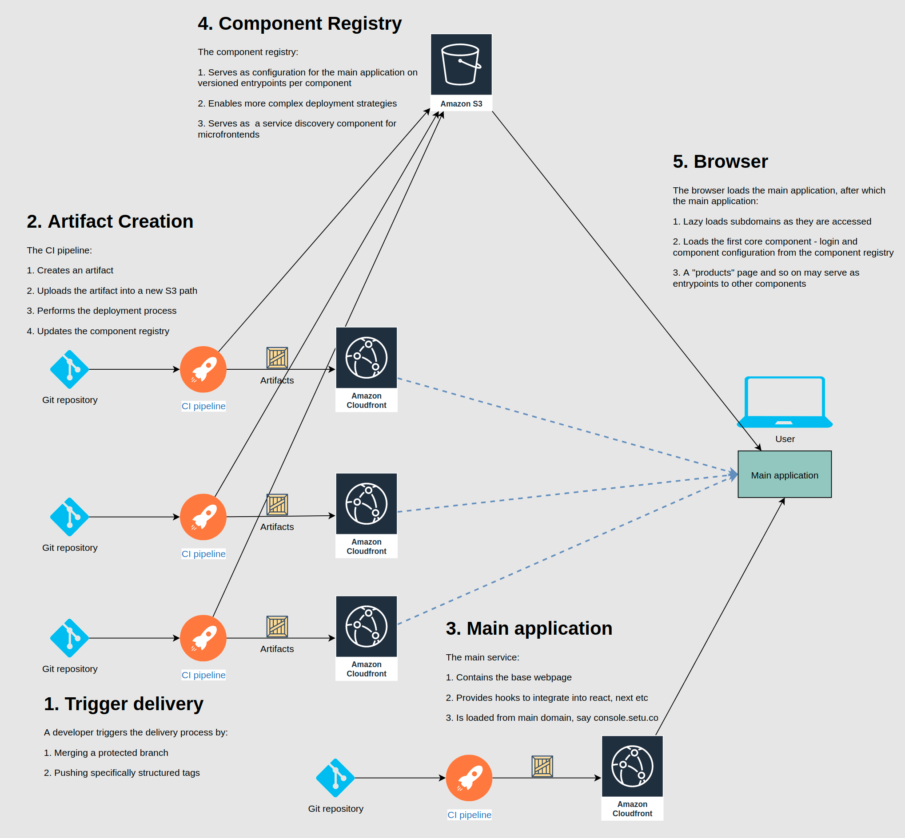

- [Background](#background)
- [Microfrontends](#microfrontends)
  - [Principles](#principles)
  - [Architecture](#architecture)
    - [Framework for making decisions](#framework-for-making-decisions)
    - [1. Define microfrontend](#1-define-microfrontend)
    - [2. Composition of microfrontends](#2-composition-of-microfrontends)
    - [3. Routing for microfrontends](#3-routing-for-microfrontends)
    - [4. Communication between microfrontends](#4-communication-between-microfrontends)
    - [Decisions](#decisions)
    - [1. Define microfrontend](#1-define-microfrontend-1)
    - [2. Composition of microfrontends](#2-composition-of-microfrontends-1)
    - [3. Routing for microfrontends](#3-routing-for-microfrontends-1)
    - [4. Communication between microfrontends](#4-communication-between-microfrontends-1)
  - [Operations](#operations)
    - [Automation](#automation)
      - [Framework for making decisions](#framework-for-making-decisions-1)
      - [1. Type of delivery artifact](#1-type-of-delivery-artifact)
      - [2. Choice of testing strategy](#2-choice-of-testing-strategy)
      - [3. Degree of coupling with other microfrontends](#3-degree-of-coupling-with-other-microfrontends)
      - [Decisions](#decisions-1)
      - [1. Type of delivery artifact](#1-type-of-delivery-artifact-1)
      - [2. Choice of testing strategy](#2-choice-of-testing-strategy-1)
      - [3. Degree of coupling with other microfrontends](#3-degree-of-coupling-with-other-microfrontends-1)
    - [Delivery Process](#delivery-process)
  - [Technology Choices](#technology-choices)
  - [Alternatives Considered](#alternatives-considered)
  - [Resources](#resources)
    - [Microfrontends](#microfrontends-1)
    - [single-spa](#single-spa)

# Background

Single-page applications (SPAs) consist of a single or a few JavaScript files that encapsulate the entire frontend application, usually downloaded upfront delivered by CDNs. They communicate with backends via APIs and handle view changes via fully managed routing.

SPAs are generally a single frontend project with backends which may range from monoliths to microservices. These frontend projects are generally owned by a single team. As project scope grows such projects become increasingly difficult due to:
- Maintainability concerns
- No clear Ownership in cases of multiple products involvement
- Conflicting priorities

# Microfrontends

Micro-frontends are an emerging architecture inspired by microservices architecture.

The main idea behind them is to break down a monolithic codebase into smaller parts, allowing an organization to spread out the work among autonomous teams, whether collocated or distributed, without the need to slow down their delivery throughput.

If the business logic and the code complexity are reduced drastically, the overhead on automation, governance, observability and communication have to be taken into consideration.

## Principles

1. Domain driven design
   - Model projects around business domains
   - Serves as a good separation of concern for projects
   - Grants teams ownership of their domains
   - Follows [Conway's law](https://en.wikipedia.org/wiki/Conway%27s_law)
2. Culture of Automation
   - Culture of automating the deployment of independent units in different environments
3. Hide Implementation Details
   - Encapsulate services to hide their details for other services
   - Helps focus on implementation
   - Limit impact of technical decisions
   - Helps each team follow their own operations and timelines
5. Decentralize All the Things
   - Architecture decisions, frameworks, governance
   - One-size-fits-all approaches no longer required
7. Deploy Independently
   - Orchestrate independently of other projects
   - End to end operational ownership
9. Isolate Failure
   - Prevent failure cascades
11. Highly Observable
   - Distributed nature requires high observability to track health

## Architecture

### Framework for making decisions

The framework for architectural decisions consists of these key points:

1. Define what a microfrontend is in your architecture
2. How will individual microfrontends compose
3. How will routing work for microfrontends
4. How would communication work between microfrontends

### 1. Define microfrontend

The individual microfrontends need to be visually split amongst themselves depending on how the projects and the business is structured. There are two possibilities that one can consider:

With the horizontal split, multiple micro-frontends will be on the same view. Multiple teams will be responsible for parts of the view and will need to coordinate their efforts. This approach provides a greater flexibility in the context where different feature-sets are handled by different teams.

In the vertical split scenario, each microfrontend is rendered into a different page. In such a structure each team can be responsible for their business domains with central authentication and user onboarding experience. Domain-driven design (DDD) takes center-stage in determining the split.

### 2. Composition of microfrontends

The 3 different ways of composing frontend applications are:

1. Client side composition
   1. An application shell loads microfrontends inside itself
   2. Possibilities include:
      1. [single-spa](https://single-spa.js.org): control routing cooperatively with hooks for major web frameworks
      2. Iframes
      3. [h-include](https://github.com/gustafnk/h-include): uses placeholder tags that will create an AJAX request to a URL and replace the inner HTML of the element with the response of the request
2. Edge-side composition
   1. Assemble views using [ESI](https://www.w3.org/TR/esi-lang) supported CDNs
   2. Not exactly a standard implementation in real world
3. Server-side composition
   1. Handle all rendering in the backend
   2. Can be paired with CDNs with large TTLs to handle asymmetric traffic

### 3. Routing for microfrontends

Based on how microfrontends compose and their splits, there are multiple corresponding routing options.

| Split | Compose | Routing |
| --- | --- | --- |
| Horizontal | Client side | Router Hooks |
| Vertical | Client side | Rendering Hooks |
| Horizontal | Edge Side | Custom |
| Vertical | Edge Side | Custom |
| Horizontal | Server Side | Custom |
| Vertical | Server Side | nginx |

### 4. Communication between microfrontends

There are multiple ways of communication between multiple microfrontends. Their choice is closely tied to how the microfrontends are split.

| Split | Solution | Libraries |
| --- | --- | --- |
| Horizontal | [Eventbus pattern](https://css-tricks.com/lets-create-a-lightweight-native-event-bus-in-javascript/) | [PubSubJS](https://github.com/mroderick/PubSubJS) |
|  |  | [mitt](https://github.com/developit/mitt) |
|  |  | [Custom events](https://developer.mozilla.org/en-US/docs/Web/Events/Creating_and_triggering_events) |
|  |  | [eventemitter3](https://github.com/primus/eventemitter3) |
|  |  | [postal.js](https://github.com/postaljs/postal.js) |
| Vertical | [Local storage](https://developer.mozilla.org/en-US/docs/Web/API/Window/localStorage) |  |
| | Cookies (auth tokens) |  |
| | Query strings |  |

### Decisions

### 1. Define microfrontend

1. Deciding the split

We choose the vertical split scenario for supporting 4 classes of components:

1. Core components
   1. Each product e.g. bridge, bbps, dg, fd etc
2. Supporting components
   1. Admin console (s)
   2. Analytics systems
   3. Support ticket raising system
3. Generic components
   1. Login & authentication
   2. User creation
4. Auxillary components
   1. Demos
   2. Private API documentation
   3. Internal utilities

This structure solves for:

1. Allowing diverse technical stacks
2. Enable business to define separation of concerns
3. Let current team structures own and operate with minimal conflicts
4. Enable a single user signup experience and IAM across the platform

Trade-offs:

1. Requires a central point for navigation into individual products, say a "products" page
2. Requires all pages to redirect back to the "products" page
3. Design consistency becomes a choice and hence enforcement a necessity for the core subdomain

### 2. Composition of microfrontends

We choose client-side composition because:

1. Wide range of options and a community building tools for the same
2. Other options have to be built in a completely custom manner

Trade-offs:

1. May lead to large initial page load times
   1. Can be solved by using lazy loading

### 3. Routing for microfrontends

We choose router hooks for the following reasons:

1. Our options are narrowed to it by previous choices
2. Encourages teams to use the most popular well-supported frameworks

Trade-offs:

1. Possibility of conflict in routes
2. Possibilities of bugs in attempts to override routing

### 4. Communication between microfrontends

We choose to use cookies, local storage and query strings to communicate between microfrontends because:

1. Standards compliant and widespread availability
2. Does not introduce any new library or component into the architecture

Trade-offs:

1. Needs uniform data sharing semantics
2. Data consistency and schema conflicts may spill across projects leading to failure cascades

## Operations

### Automation

#### Framework for making decisions

The framework for taking decisions on automation depends of these key points:

1. Type of delivery artifact
2. Choice of testing strategy
3. Degree of coupling with other microfrontends

#### 1. Type of delivery artifact

The type of delivery artifact depends on the chosen split and composition method.

Key considerations here include:

1. Enable fast iteration
2. Enable fast feedback loops
3. Encourage standardization for maintainability of automation
4. Empower teams to own artifact creation process
5. Developer experience

#### 2. Choice of testing strategy

The testing strategy has an large impact on designing automation.

1. Environments strategy
   1. Maintain different environments - testing, sandbox and production
   2. The testing environment is bleeding edge
2. Version control strategy: Mono-repo or poly-repo
   1. Defines testing artifact
   2. Determines whether each microfrontend can be independently tested

#### 3. Degree of coupling with other microfrontends

1. Tight coupling
   1. Requires an additional step of composing and building the final application
2. Loose coupling
   1. Each microfrontend's automation can be operated in isolation

#### Decisions

#### 1. Type of delivery artifact

We choose babel compiled javascript and other assets delivered via a CDNs per microfrontend as the delivery artifact.

#### 2. Choice of testing strategy

We choose to stick to the environments strategy as it is already in place.

#### 3. Degree of coupling with other microfrontends

We choose to have minimal to no coupling between microfrontends.

### Delivery Process

The entire delivery process is described in the following diagram:

A more involved versioned operations pipeline would look like:

## Technology Choices

We choose [single-spa](https://single-spa.js.org) for integrating with routers of various frontend frameworks.

Components to be built:

1. Main app: The main app corresponds to the single-spa [root config](https://single-spa.js.org/docs/configuration)
   1. Example: https://github.com/mellis481/root-config
2. Auth: A core component that handles authentication, IAM and user signup as the single-spa root application
   1. Example: https://github.com/mellis481/root-app
   2. Docs: https://single-spa.js.org/docs/building-applications
3. Other applications

Framework support:

1. [React](https://single-spa.js.org/docs/ecosystem-react/)
2. [Vue](https://single-spa.js.org/docs/ecosystem-vue/)
3. [Angular](https://single-spa.js.org/docs/ecosystem-angularjs/)
4. [and 10 more](https://single-spa.js.org/docs/ecosystem)

## Alternatives Considered

-  [Isomorphic Layout Composer / ILP](https://github.com/namecheap/ilc)
   - Main USP: Isomorphic apps with backend rendering
   - We do not intend the console to be backend rendered
- [Opencomponents](https://github.com/opencomponents/oc)
  - Very nascent stage
- [icestark](https://github.com/ice-lab/icestark)
  - Not much ecosystem adoption

## Resources

### Microfrontends

- https://micro-frontends.org
- https://github.com/neuland/micro-frontends
- https://github.com/umijs/qiankun
- https://github.com/topics/micro-frontends
- https://github.com/topics/ui-composition
- https://learning.oreilly.com/library/view/building-micro-frontends/9781492082989/

### single-spa

- https://single-spa.js.org/docs
- https://single-spa.js.org/docs/building-applications
- https://single-spa.js.org/docs/testing/e2e
- https://single-spa.js.org/docs/recommended-setup
- https://github.com/WICG/import-maps
- https://dev.to/marais/webpack-5-and-module-federation-4j1i

